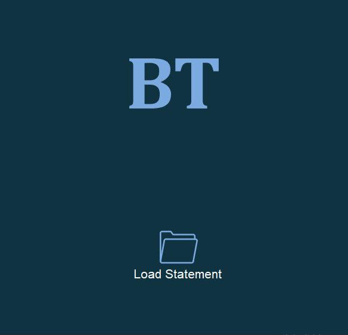
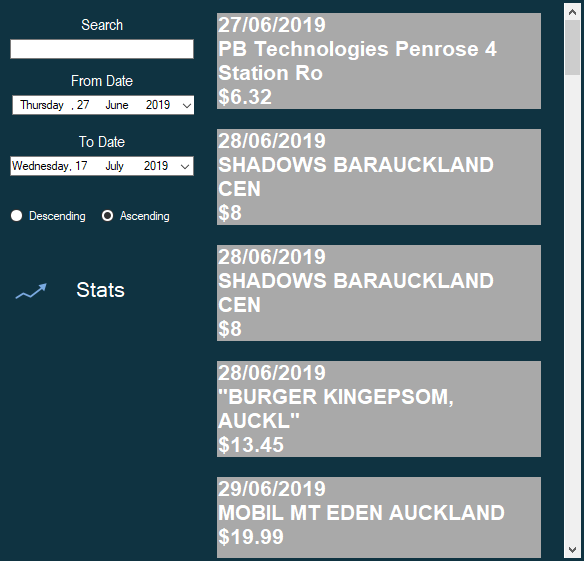
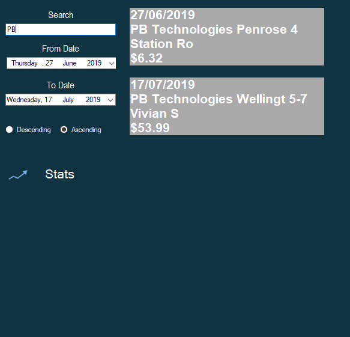
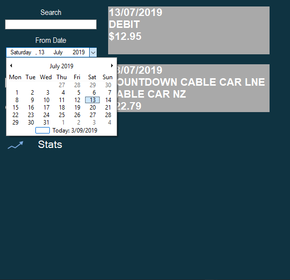
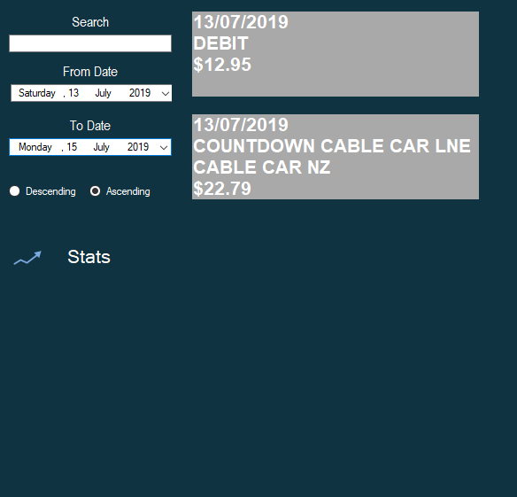
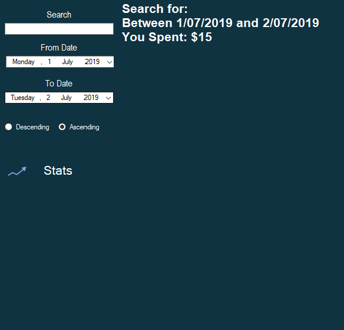

# BankTracker
WindowsForms Application to read and analyse statement CSV downloaded from ASB online banking
## Loading Screen
Here the user can open load an ASB CSV statement file by clicking on the load statement button. This will open up a file chooser.

## Transactions Screen
Here all the transactions are displayed on the screen, the user can then search for key words, adjust the From and To Date, as well as if the dates should be ascending or descending.

## Filtering
Example results of search Filtering

Example results of date filtering

 

## Stats
Shows the amount spent for the transactions currently been filtered.

